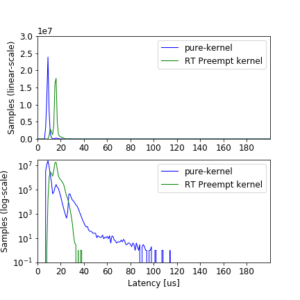
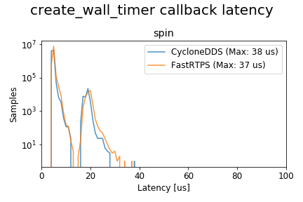

# ros2_timer_latency_measurement

## Overview

This measure the accuracy of the timer when the priority of the ROS2-generated child thread change.
Following Latencies are measured.

- Latency of nanosleep wake-up between child threads policies TS and RR
  There are two patterns of child threads, as follows
  - child threads : rclcpp::init() generated only.
  - child threads : rclcpp::init() + node decleration generated
- Latency of Timer callback between nanosleep + spin_some vs spin
  Each measurement point is as follows.
  - nanosleep + spin_some : The latency between the time nanosleep expected to wake-up and the callback is actually called.
  - spin : The latency between the time callback expected to be called and actually called.


## Setup

### Environment
The main environment is as follows:

- Hardware : Raspberry Pi 3B +
- OS : ubuntu 18.04 4.19.55-rt24-v7+
- ROS Distro : ROS 2 Eloquent Elusor
- DDS : FastRTPS(v1.9.3P1) or CycloneDDS(0.1.0)

For building environment, see [setup.md](./setup.md).

Cyclictest results before and after setup.


### Build

```
source ~/ros2_eloquent/install/setup.bash
cd ~/ros2_ws/src
git clone https://github.com/hsgwa/ros2_timer_latency_measurement.git
colcon build --symlink-install
```

## Run

### Example

```
source ~/ros2_eloquent/install/setup.bash
source ~/ros2_ws/install/local_setup.sh
export RMW_IMPLEMENTATION=rmw_fastrtps_cpp

taskset -c 1 ~/ros2_ws/build/ros2_timer_latency_measurement/init_thread \
        --use_realtime_child_thread \
        --timeseries_filename timeseries.csv \
        --hist_filename raw/hist.csv \
        --topn_filename raw/topn.csv \
        --rttest_args -m 200mb -d 200mb -t 98 -s rr -u 10ms -i 720000
```
### Excuetable files

The following is a list of executable files.

| executable file             | measurement target        | conditons                              |
|-----------------------------|---------------------------|----------------------------------------|
| init_thread                 | nanosleep wake-up latency | rclcpp::init generated thread          |
| init_and_node_thread_thread | nanosleep wake-up latency | rclcpp::init and DDS generated threads |
| timer_cb_latency_spin_some  | callback latency          | nanosleep + spin_some executor         |
| timer_cb_latency_spin       | callback latency          | single thread executor                 |


### Comand line options


Each executable can be configured with command line options.

| options                       | descriptions                                              |
|-------------------------------|-----------------------------------------------------------|
| --use_realtime_child_thread   | Set child threads policy. real-time (inherit rttest_args) |
| --unuse_realtime_child_thread | Set child threads policy. TS                              |
| --timeseries_filename         | Set filepath to export time-series cav data               |
| --hist_filename               | Set filepath to export histgram csv data                  |
| --topn_filename               | Set filepath to export topN latency data.                 |

The options after --rttest_args will be sent to rttest.
The availabile options are as follows.
Here, rttest version is tag:0.9.0.

| options | descriptions                                                         |
|---------|----------------------------------------------------------------------|
| -m      | Set maximum stack prefault size for static stack prefaulting.        |
| -d      | Set maximum heap prefault size for dynamic memory prefaulting.       |
| -t      | Set the thread priority of all threads launched by the test program. |
| -s      | Set scheduling policy  fifo/rr                                       |
| -u      | Specify the update period.                                           |
| -i      | Specify how many iterations to run the real-time loop.               |

Please see [rttest](https://github.com/ros2/realtime_support/tree/master/rttest) for more information on each option.


## Results
### Comparison of nanosleep wake-up latency between child threads policies TS and RR


Timer jitter gets worse If the child threads policies are RR equal to the main thread.
The wake-up latency of the nanosleep timer is the same level low jitter as the cyclictest result if the policies of child threads are TS.


### Timer callback latency between nanosleep + spin_some vs spin
In the nanosleep + spin_some case, the callback execution always waits until the wake-up nanosleep, and the callbacks are executed synchronously.
In the spin case, the callback will be performed immediately.
Here, we verified the latency for the timer callback to be executed.


The results in the case of nanosleep + spin_some show that the latency range is around 150 ~ 500 us.
In the case of spin, the latency range is only 30-50us, and the jitter is lower than or equal to the cyclictest.

When the policies of child threads are TS, the timer callback execution latency with spin is as low jitter as or better than the cyclictest results.


To confirm the reliability of the callback latency with spin, we measured 8.64 million loops with 10 ms cycles (24 hours).



The 24-hour measurement results were also low jitter, so the timing of the timer callback execution is accurate.
